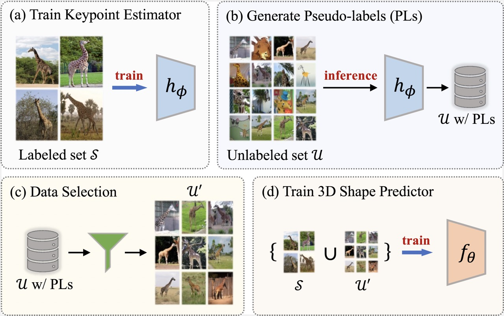

# Learning Articulated Shape with Keypoint Pseudo-labels from Web Images
Code repository for the paper:\
**Learning Articulated Shape with Keypoint Pseudo-labels from Web Images**\
[Anastasis Stathopoulos](https://statho.github.io), [Georgios Pavlakos](https://geopavlakos.github.io/), [Ligong Han](https://phymhan.github.io/), [Dimitris Metaxas](https://people.cs.rutgers.edu/~dnm/)\
CVPR 2023\
[[paper](https://arxiv.org/abs/2304.14396)] [[project page](https://statho.github.io/projects/animals3d/)]



## Installation
We recommend installing the dependencies in a clean conda environment by running:
```
conda env create -f environment.yml
```

After the installation is complete, activate the conda environment by running:
```
conda activate animals3d
```

Then, you should install the Neural Mesh Renderer. Before installing run:
```
cd external
export CUDA_HOME=/usr/local/cuda
```

Check the CUDA version of PyTorch by running `python -c 'import torch; print(torch.version.cuda)'`. Make sure you set the right `CUDA_HOME` and build extension. Then run:
```
python setup.py install
```

The next step is to install `acsm` as Python package. Since you might want to modify the code, we recommend running the following:
```
cd ../acsm
python setup.py develop
```

## Data Prepartation
Now that the installation is complete, please follow the [data preparation](docs/prepare_data.md) instructions to prepare the data.


## Keypoint PLs on Web Images

We describe our pipeline for training with web images. In case you do not want to use unlabeled images from the web, you can skip this section.

### 1) Download web images

We download web images from [Flickr](https://www.flickr.com/) using metadata from the [YFCC100m](http://www.multimediacommons.org/) dataset. Instead of downloading all metada from YFCC100m, we used the search bar in this [website](http://projects.dfki.uni-kl.de/yfcc100m/) that enables downloading the metadata for a desired category in a single json file. We provide the downloaded metadata for the 5 animal categories used in our paper in [categ_ids.zip](https://drive.google.com/file/d/1usFrsXIojEjV1ERQFTpIhjFwMze5UI8P/view?usp=share_link). Download the file and extract it in `prepare_data`.

You can download web images for the desired category with the following command:
```
python prepare_data/download_images.py --category <category>
```
The downloaded images are stored in `data/yfcc100m/images/<category>`.


### 2) Bounding box detections
You should create bounding box detections with by running:
```
python prepare_data/save_boxes.py --category <category> \
--opts MODEL.WEIGHTS detectron2://COCO-Detection/faster_rcnn_X_101_32x8d_FPN_3x/139173657/model_final_68b088.pkl
```
The above command will store the detections in `data/yfcc100m/labels_0/<category>_bbox.json` file.

### 3) PLs with 2D pose estimator
Download the weights for models trained with 150 labeled images from the [checkpoints.zip](https://drive.google.com/file/d/1ynhKPsiTfUmivNE9AnlCOQ8ZDOTvSKx4/view?usp=share_link) and extract it in `pose/results/checkpoints`. You can generate keypoint pseudo-labels by running the following command from the `pose` directory
```
python generate_pl.py --category <cateogory>
```
Running the above command will create keypoint pseudo-labels with the provided weights. We also provide training and evaluation code for the pose estimation network. Details can be seen [here](docs/pose.md).


### 4) Data Selection
We provide the code for the four data selection criteria used in the paper. To create a subset of web images and generated PLs for training, run the following command.
```
python prepare_data/data_selection.py --category <category> --filter <selection_criterion> --selection_num <number of images>
```
Adding the argument `--visualize` to the above command will additionally create some visualizations. Next, we offer more details on the four data selection creteria:

1. KP-Conf: This criterion uses the detection confidence from the PLs genereated previously.
2. CF-MT: This criterion selects samples based on multi-transform consistency. Before running the data selection script run the following command from the `pose` directory, to generate PLs for multiple input image transformations.
```
python generate_pl_mt.py --category <category>
```
3. CF-CM: This criterion requires predictions from an auxiliary pose estimator. You can train another pose estimator as described [here](docs/pose.md). Then, generate keypoint PLs with the following command (run from the `pose` directory):
```
python generate_pl.py --category <cateogory> --name <name> --is_aux
```
4. CF-CM<sup>2</sup>: This criterion requires keypoint predictions from a 3D shape predictor. You can generate keypoint PLs using ACSM with the following command (run from the `acsm` directory):
```
python scripts/generate_pl.py --scale_mesh --category <category> --name <name> --iter_num <iter_num>
```

## Training and Evaluation with ACSM

### Run Evaluation Code
You can evaluate the ACSM models by running the following command from the `acsm` directory.
```
python scripts/evaluate.py --category sheep --dataset pascal --scale_mesh --kp_anno --sfm_anno
```
Running the above command will compute the AUC and the camera error for 3D reconstructions of sheep in Pascal using the provided model weights. The provided models are trained with 150 labeled images and keypoint pseudo-labels from web images. You can change the arguments in `--category` and `--dataset` for evaluation with different categories and datasets respectively.

### Run Visualization Code
You can visualize the predicted shapes from ACSM by running the following command from the `acsm` directory.
```
python scripts/visualize.py --category horse --dataset pascal --scale_mesh --vis_num 20
```
Running the above command will generate visualizations for 20 random images with horses from Pascal dataset. You can change the arguments in `--category` and `--dataset` for generating visual results with different categories and datasets respectively.


### Run Training Code
You can train ACSM yourself with the `acsm/scripts/train.py` script. The training code is adapted from the [official repo](https://github.com/nileshkulkarni/acsm) and uses vizdom for visualizations during training. Before running the training script start the vizdom server from the `acsm` directory with the following command:
```
python -m visdom.server -port <port to forward results>
```

Train your model with a command as shown in the following example:
```
python scripts/train.py --name horse_150 --category horse \
--kp_anno --scale_mesh --flip_train True --plot_scalars --display_visuals \
--use_pascal --use_coco
```
Running the above command will train a model for 3D shape prediction of horses with 150 labeled images and the default settings.

To utilize keypoint PLs from web images, also include the following arguments in the previous command.
```
--use_web_images --web_images_num <number of images with PL> --filter <selection criterion name>
```
Note that you need to have downloaded the web images and created keypoint PLs before including the above arguments for training your model.

## Acknowledgements
Parts of the code are borrowed or adapted from the following repos:
- [ACSM](https://github.com/nileshkulkarni/acsm)
- [PyTorch-Pose](https://github.com/bearpaw/pytorch-pose)
- [CMR](https://github.com/akanazawa/cmr)
- [UCMR](https://github.com/shubham-goel/ucmr)
- [Detectron2](https://github.com/facebookresearch/detectron2)

## Citation
If you find this code useful for your research or the use data generated by our method, please consider citing the following paper:

	@Inproceedings{stathopoulos2023learning,
	  Title  = {Learning Articulated Shape with Keypoint Pseudo-labels from Web Images},
	  Author = {Stathopoulos, Anastasis and
      Pavlakos, Georgios and
      Han, Ligong and
      Metaxas, Dimitris},
	  Booktitle = {CVPR},
	  Year = {2023}
	}